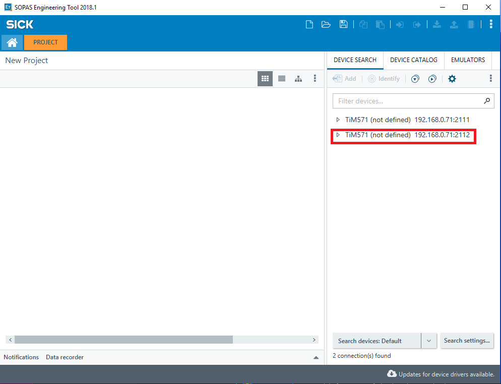
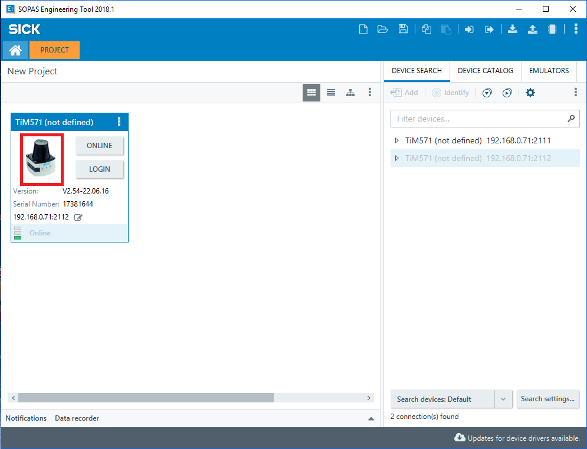
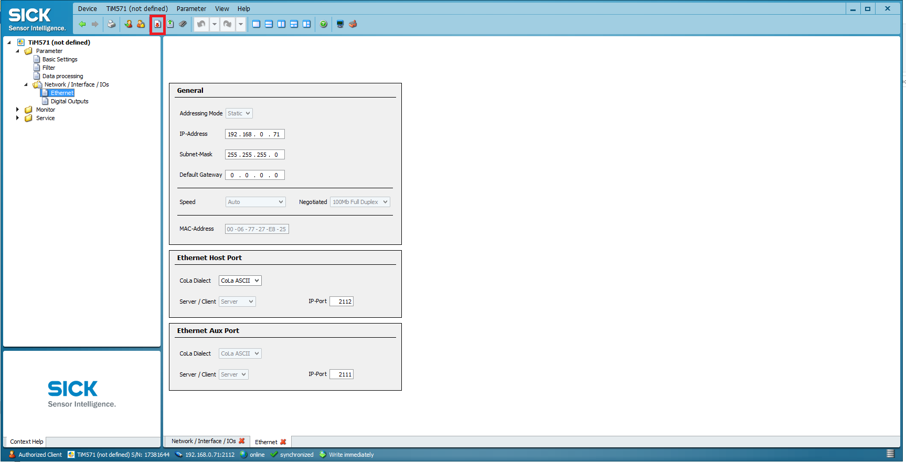
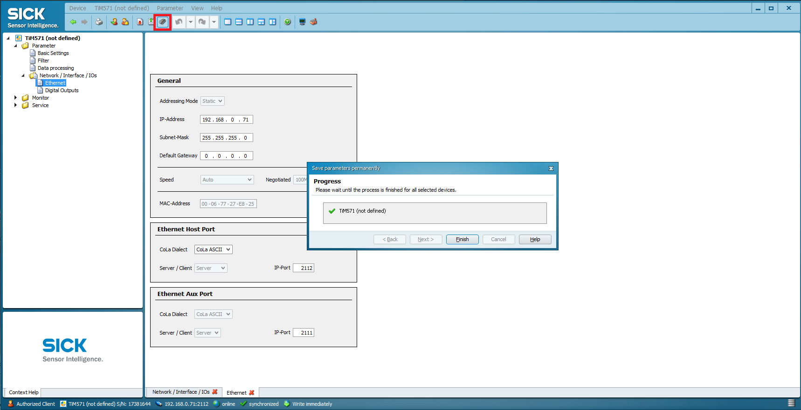
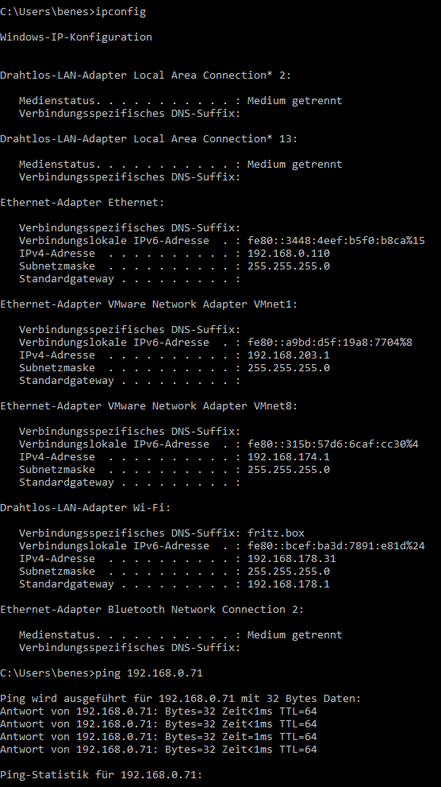

# IP addresses configuration
#Detecting SICK devices in the network 
The Python script 
```sick_scan/tools/sick_generic_device_finder/sick_generic_device_finder.py```
sends a UDP broadcast to which all available scanners respond with a device description.
The varibale ```UDP_IP = "192.168.0.255"``` defines the broardcast adress used by the script. 
If you are using a different IP address configuration on your host pc you have to change this variable according to the brodcast address of your network card.   
```ifconfig``` shows the broadcast adress for every network adapter.
#Change IP addresses
The IP addresses of the devices can be changed with a customized launch file.

Changing the IP address currently has the following limitations and is only temporary:
 * a) It is only available in ASCII mode.
 * b) For security reasons, writing to the EEprom has not yet been activated. 

The following launch sequence is an example:
 
```roslaunch sick_scan sick_new_ip.launch hostname:=192.168.0.1 new_IP:=192.168.0.100```

The launchfile restarts the scanner after the address change and ends the sick_scan node. After a few seconds of booting time the scanner is reachable under the new IP address.
## Starting with a new scanner
The scanner is delivered with a standard IP address, to read or change it the [SICK SOPAS ET](https://www.sick.com/de/de/sopas-engineering-tool-2018/p/p367244) for windows can be used.
When the tool is started, a search is performed which lists all scanners available in the network. 

Double-click to select the scanner for the project

double click on the scanner icon to open the configuration menu of the scanner
Select here the network configuration menu and set the parameters by clicking on the save icon (red arrow)

To ensure that the settings are retained even after a Powercycle, they must be stored in the eeprom. To do this, click on the eeprom icon and confirm the save. 

To test the settings under Windows use the comandos ```ipconfig``` and ```ping``` in the ```cmd.exe```. Make sure that the scanner and host pc have different ip addresses e.g. 192.168.0.110 for the pc and 192.168.0.71 for the scanner. 

## test connection under Linux
to test the settings under the Linux target system you can use netcat to check if a TCP connection to the scanner can be established
```nc -z -v -w5 $SCANNERIPADDRESS 2112```
the connection can be successfully established


unlike a ping, the connection attempt to the hostpc is not successful


------------------------------------------------------------------------


